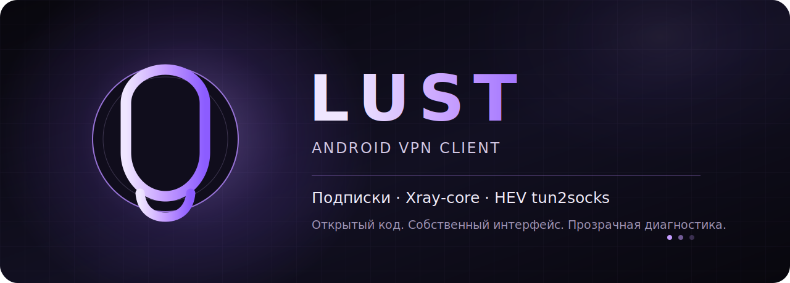

<p align="center">
  
</p>

<p align="center">
  <a href="https://github.com/envywook/Lust/releases"></a>
  <a href="https://github.com/envywook/Lust/actions/workflows/android.yml"></a>
  <a href="LICENSE"></a>
  
  
</p>

<p align="center">
  Открытый Android VPN-клиент на Kotlin и Jetpack Compose.<br>
  Подписки, выбор сервера, Xray-core и прозрачная диагностика VPN-сессии.
</p>

<p align="center">
  <a href="https://github.com/envywook/Lust/releases"><strong>Скачать APK</strong></a>
  ·
  <a href="#сборка"><strong>Собрать из исходников</strong></a>
  ·
  <a href="#статус-проекта"><strong>Статус проекта</strong></a>
</p>

---

## О проекте

**Lust** — Android VPN-клиент с собственным тёмным интерфейсом, управлением подписками и нативным сетевым конвейером на базе Xray-core и HEV tun2socks.

Проект создаётся как понятная, расширяемая альтернатива перегруженным универсальным клиентам: обычные действия доступны из основного интерфейса, а технические события и ошибки не скрываются от пользователя.

> [!WARNING]
> **Текущий статус — alpha.** APK предназначен для разработки и тестирования. Проект ещё не прошёл полный аудит безопасности и приёмочные испытания на широком наборе устройств. Текущий release использует debug-подпись.

## Возможности

### Уже реализовано

- тёмный интерфейс на **Jetpack Compose + Material 3**;
- главный экран, серверы, подписки, журнал и настройки;
- добавление и обновление подписок по URL;
- Base64 и plain-text списки серверов;
- импорт ссылок **VLESS, VMess, Trojan и Shadowsocks**;
- сохранение подписок и выбранного сервера;
- Android `VpnService` и foreground-уведомление;
- запуск **Xray-core** через `AndroidLibXrayLite`;
- преобразование TUN → SOCKS через **HEV tun2socks**;
- state machine: подключение, работа, отключение и ошибка;
- персистентный журнал событий UI/core/service со stack trace;
- автоматические unit-тесты и сборка APK в GitHub Actions.

### В разработке

- стабилизация полного connect/disconnect pipeline на реальном устройстве;
- фильтры, поиск и экспорт журнала;
- статистика трафика и задержки;
- гибкая маршрутизация, DNS и правила;
- автоматическое восстановление после смены сети;
- настоящее переключение Xray / sing-box;
- production signing и оптимизированные ABI-релизы.

## Поддерживаемые форматы

| Формат | Импорт | Генерация Xray-конфигурации | Статус |
|---|:---:|:---:|---|
| VLESS | ✅ | ✅ | Alpha |
| VMess | ✅ | ✅ | Alpha |
| Trojan | ✅ | ✅ | Alpha |
| Shadowsocks | ✅ | ✅ | Alpha |
| Subscription URL | ✅ | — | Base64 или plain text |
| sing-box runtime | — | — | Запланирован, не реализован |

> Поддержка формата ссылки не означает совместимость со всеми комбинациями transport/security. Перед использованием проверяйте конкретный профиль и журнал подключения.

## Архитектура

```text
┌───────────────────────────── LUST ──────────────────────────────┐
│                                                                 │
│  Jetpack Compose UI                                             │
│     │                                                           │
│     ├── SubscriptionRepository → Parser → Xray JSON             │
│     │                                                           │
│     └── DualCoreVpnService                                      │
│             │                                                   │
│             ▼                                                   │
│       VpnSessionCoordinator ───────────────→ Persistent AppLog  │
│             │                                  ▲                │
│             ├── XrayEngine ────────────────────┤                │
│             │       ▲                          │                │
│             └── Android TUN → HEV tun2socks ──┘                │
│                                   │                             │
│                                   └──→ SOCKS 127.0.0.1:10808    │
│                                                │                │
│                                                └──→ Xray → сеть │
└─────────────────────────────────────────────────────────────────┘
```

### Поток подключения

```text
Профиль подписки
      │
      ▼
SubscriptionParser → Xray JSON с локальным SOCKS inbound
      │
      ▼
DualCoreVpnService → VpnSessionCoordinator
      │
      ├── Android VpnService создаёт TUN
      ├── HEV tun2socks получает TUN FD
      └── XrayEngine запускает локальный SOCKS и outbound

Android traffic → TUN → HEV → SOCKS 127.0.0.1:10808 → Xray → сеть
```

## Скачать

Готовые сборки публикуются на странице [GitHub Releases](https://github.com/envywook/Lust/releases).

Последняя alpha-версия:

- [Lust v0.1.1-alpha](https://github.com/envywook/Lust/releases/tag/v0.1.1-alpha)
- [APK](https://github.com/envywook/Lust/releases/download/v0.1.1-alpha/Lust-v0.1.1-alpha-debug.apk)
- [SHA256SUMS.txt](https://github.com/envywook/Lust/releases/download/v0.1.1-alpha/SHA256SUMS.txt)

Для APK проверяйте SHA-256 перед установкой. Android может предупреждать об установке приложения вне магазина — это нормально для GitHub-сборки.

## Сборка

### Требования

| Компонент | Версия/требование |
|---|---|
| JDK | 17 |
| Android SDK | 34 |
| Gradle wrapper | 8.5 |
| Android Gradle Plugin | 8.2.2 |
| Kotlin | 1.9.22 |
| CLI | `curl`, `unzip`, `readelf`, `strings` |

### Команды

```bash
git clone https://github.com/envywook/Lust.git
cd Lust

./scripts/prepare-native-deps.sh
./gradlew testDebugUnitTest assembleDebug
```

APK появится здесь:

```text
app/build/outputs/apk/debug/app-debug.apk
```

Нативные бинарники не хранятся в Git. `prepare-native-deps.sh` загружает закреплённые версии и проверяет SHA-256:

- `AndroidLibXrayLite v26.7.19`;
- HEV-библиотеки из официальных APK v2rayNG `2.2.6`.

## CI/CD

Workflow [Android CI and Release](.github/workflows/android.yml):

| Событие | Результат |
|---|---|
| Push в `main` | unit-тесты, сборка APK, CI artifact |
| Pull request | unit-тесты и сборка |
| Тег `v*` | тесты, сборка и GitHub pre-release с APK и SHA-256 |
| Ручной запуск | тесты и CI artifact |

[](https://github.com/envywook/Lust/actions/workflows/android.yml)

## Статус проекта

| Подсистема | Состояние |
|---|---|
| UI shell | 🟡 Базовые пять разделов готовы |
| Подписки и выбор сервера | 🟡 Реализовано, расширяется совместимость |
| Xray runtime | 🟡 Интегрирован, продолжается device acceptance |
| HEV tun2socks | 🟡 JNI подключён, startup pipeline стабилизируется |
| Персистентная диагностика | 🟢 Работает |
| sing-box runtime | ⚪ Запланирован |
| Production signing | ⚪ Не настроен |
| Security review | ⚪ Не завершён |

## Безопасность

- Не публикуйте subscription URL, UUID, ключи REALITY и другие секреты в issues или логах.
- Не устанавливайте APK из непроверенных зеркал.
- Уязвимости отправляйте по инструкции в [SECURITY.md](SECURITY.md), а не через публичный issue.
- Правила использования сторонних компонентов перечислены в [THIRD_PARTY_NOTICES.md](THIRD_PARTY_NOTICES.md).

## Участие в разработке

Issues и pull requests приветствуются. Для отчёта об ошибке приложите:

1. модель устройства и версию Android;
2. версию Lust;
3. тип профиля без секретных параметров;
4. точную последовательность действий;
5. обезличенный фрагмент журнала.

Перед pull request выполните:

```bash
./gradlew testDebugUnitTest assembleDebug
```

## Лицензия

Исходный код Lust распространяется по лицензии [GNU GPL-3.0](LICENSE).
Сторонние компоненты сохраняют собственные лицензии — см. [THIRD_PARTY_NOTICES.md](THIRD_PARTY_NOTICES.md).

---

<p align="center">
  <strong>Lust</strong> · Android · Kotlin · Xray-core · HEV tun2socks
</p>
